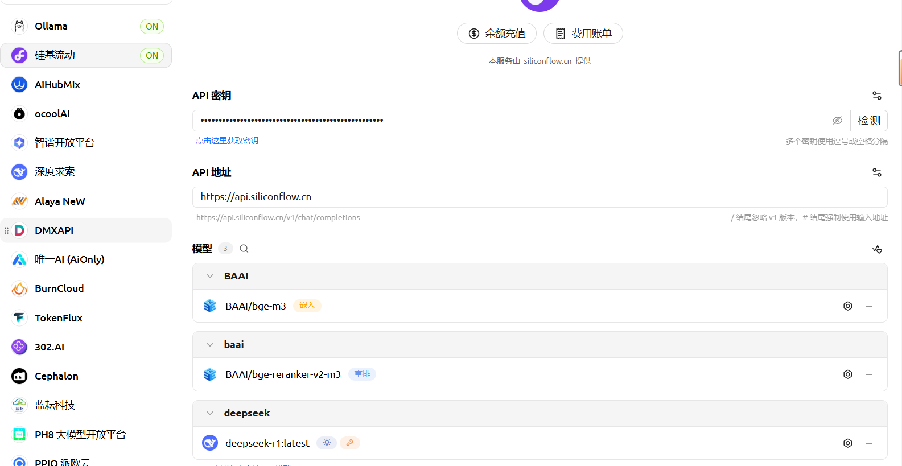
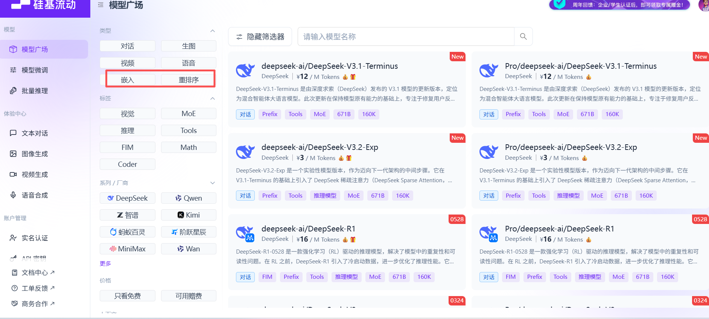
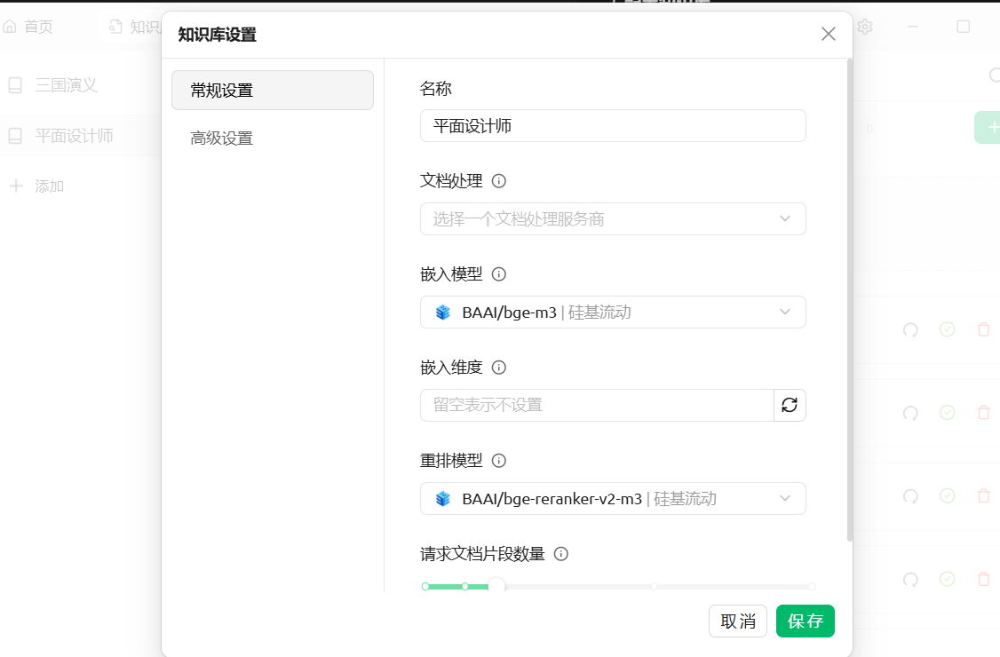
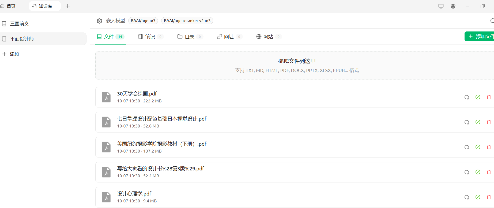

## [下载](https://www.cherry-ai.com/)安装Cherry Studio

## [下载](https://ollama.com/)安装ollama模型


```
// 下载大预言模型，官网课查看有哪些大语言模型
ollama pull qwen2.5
// 查看已安装模型
ollama list
// 测试模型
ollama run 
//启动ollama服务
ollama serve
```


##  Cherry Studio设置

右上角设置图标（windows）配置ollama和硅基流动




[硅基流动](https://cloud.siliconflow.cn/)注册登录后可获取API key

选择不同类型，复制名字。





## 创建知识库

左上角 + 号，选择知识库，选择模型、请求文档片段数量。

添加文档：将材料拖进去即可







## 问答

首页-话题-新建话题，输入框选择对应知识库

需要启动Ollama

```
# 启动 Ollama 服务  服务会在后台运行，监听端口 11434
ollama serve
```


